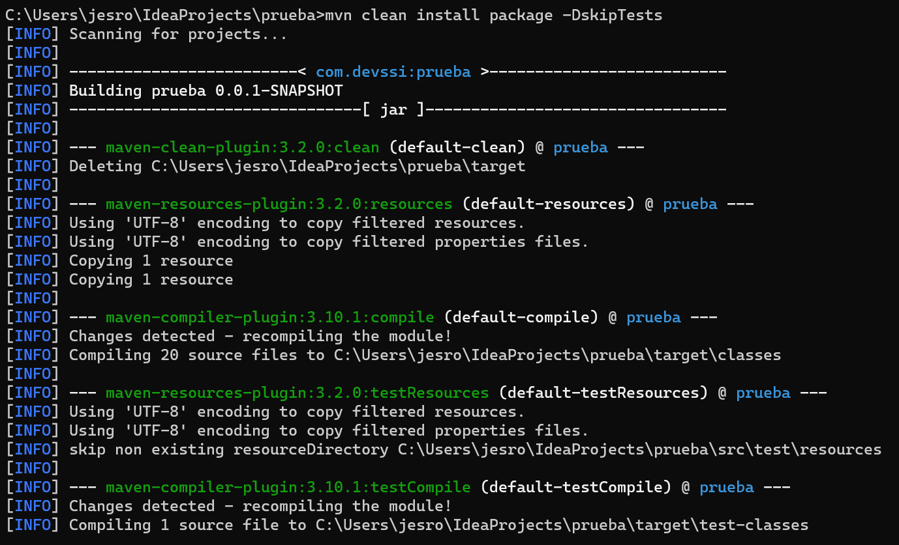
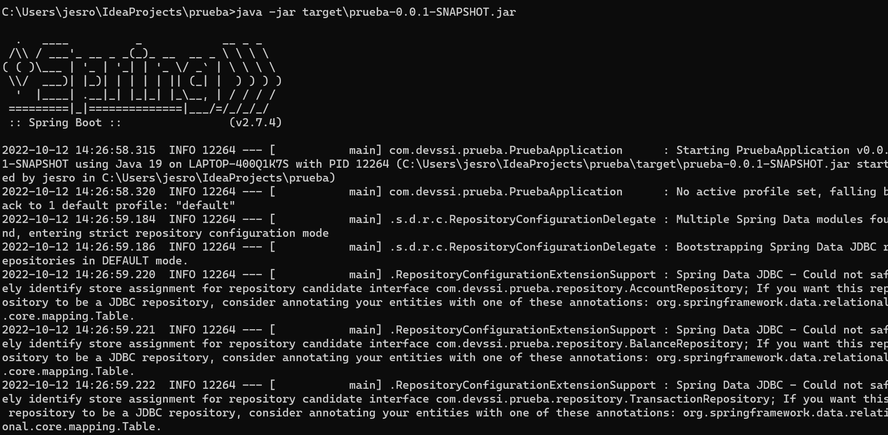
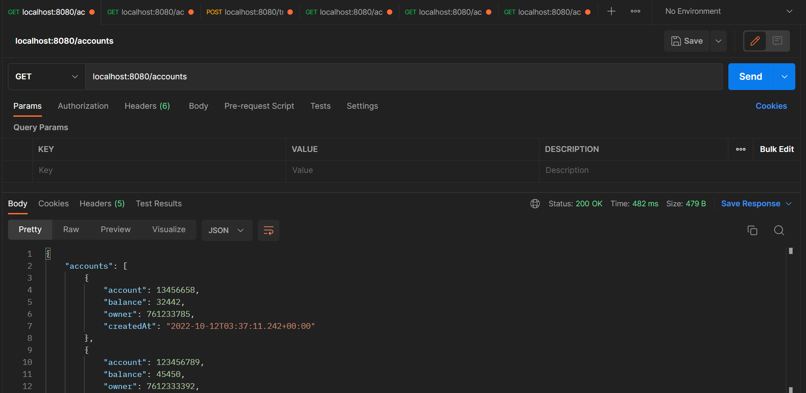

# pruebaTecnica

Prueba Técnica que emula transferencias.

# Proceso de ejecución local

para ejecutar se deben correr los siguientes comandos

```shell
mvn clean install package -DskipTests
java -jar target\prueba-0.0.1-SNAPSHOT.jar
```

se verá la salida de este modo:




La aplicación responde a las peticiones en la dirección [localhost:8080](localhost:8080)

# Endpoints

- listar todas las cuentas

```http request
GET localhost:8080/accounts
```

- obtener el balance de una cuenta

```http request
GET localhost:8080/accounts/{{accountId}}/balance
```

- obtener todas las transacciones de una cuenta

```http request
GET localhost:8080/accounts/{{accountId}}/transactions
```

- obtener todas las transacciones enviadas de una cuenta

```http request
GET localhost:8080/accounts/{{accountId}}/sent-transactions
```

- obtener todas las transacciones recibidas de una cuenta

```http request
GET localhost:8080/accounts/{{accountId}}/received-transactions
```

- hacer una transferencia entre cuentas

```http request
POST localhost:8080/transactions
```

cuerpo de la petición

```json
{
  "fromAccount": 987654321,
  "toAccount": 123456789,
  "amount": 9954
}
```

# Ejemplo


